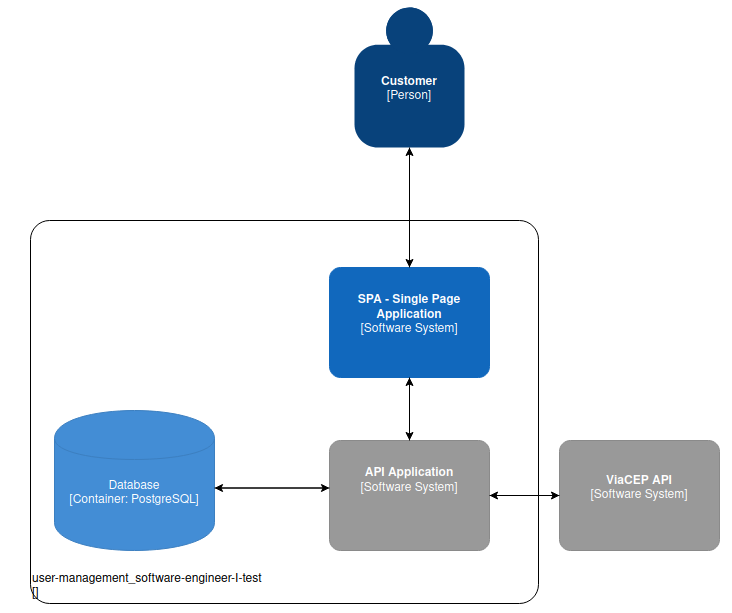
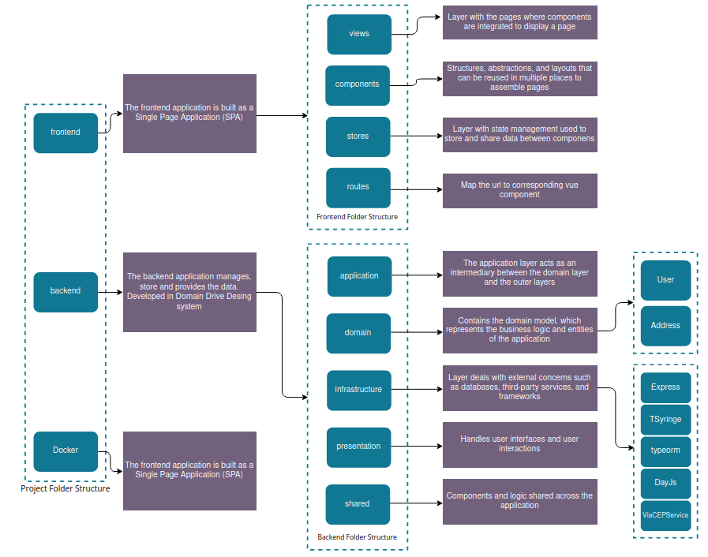

# User Management

A simple user management application with address validation by the ViaCEP API. Built in Node.js with Express, TypeORM, TypeScript, Vue, Tailwind and more.

### Technologies Used

- [Node](https://nodejs.org/en)
- [TypeScript](https://www.typescriptlang.org/)
- [Express](https://expressjs.com/)
- [Typeorm](https://typeorm.io/)
- [Vue](https://vuejs.org/)
- [Tailwind](https://tailwindcss.com/)
- [Axios](https://axios-http.com/docs/intro)
- [Docker e Docker Compose](https://www.docker.com/)
- [PostgreSQL](https://www.postgresql.org/)
- And more...

### Requirements

- [Node e NPM - v^18](https://nodejs.org/en)
- [PostgreSQL](https://www.postgresql.org/)

or

- [Docker and Docker Compose](https://www.docker.com/)

### Techniques and Tools

- Componentization
- Responsiveness
- Docker
- SOLID Principles
- Code Reusability
- And more...

---
## Project Architecture


---

## Design Architecture


---

## Configuration

1. Clone the project to your machine

```bash
git clone https://github.com/mauricioccardoso/user-management_software-engineer-I-test.git
```

1.1 If you have Docker and Docker Compose configured on your machine, proceed to [Docker and Docker Compose](#docker-and-docker-compose-configuration).
If you don't have Docker, continue to the configuration below.

2. Access the project's root folder and navigate to the app folder

```bash
cd user-management_software-engineer-I-test/backend
```

3. Install dependencies

```bash
npm install
```

4. Wait for the project dependencies to be installed

5. After generating and configuring your database. Configure the variables related to the database in the ormconfig.json file


6. Execute the migration command

```bash
npm run typeorm migration:run
```

7. Start the backend development server

```bash
npm run dev
```

8. Return to the project's root folder and access the frontend folder

```bash
cd user-management_software-engineer-I-test/frontend
```

9. Install dependencies

```bash
npm install
```

10. Start the backend development server

```bash
npm run dev
```

11. Once the containers are ready, access in the browser

App - [http://localhost:5173/](http://localhost:5173/)

### Docker and Docker Compose Configuration

1. After cloning the project, navigate to the project's root folder from the terminal or in the text editor or IDE terminal

2. Use the following command to start the containers and wait for the completion.

```bash
docker compose up -d
```

or, to start the containers and check the logs in case of an error

```bash
docker compose up -d && docker compose logs -f
```

4. Once the containers are ready, access in the browser

App - [http://localhost:5173/](http://localhost:5173/)

--- 

## Contribution

- ***[Maurício Erick da Costa Cardoso](https://portfolio-mauricio-cardoso.vercel.app/home)***

    - FullStack Developer - ***PHP LARAVEL VUE.js TYPESCRIPT NODE.js DOCKER TAILWIND BOOTSTRAP MYSQL POSTGRESS LINUX GIT and More***

- **[GitHub](https://github.com/mauricioccardoso)**

- **[LinkedIn](https://www.linkedin.com/in/mauricioccardoso/)**

- **<mauricioerick17@gmail.com>**